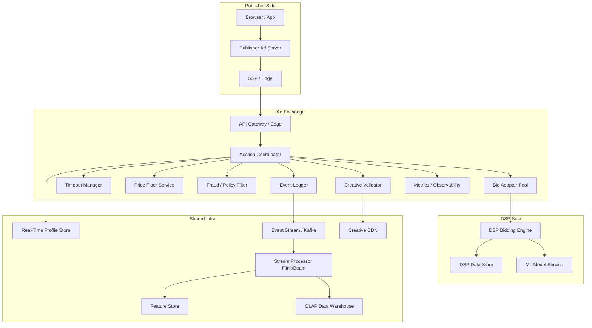
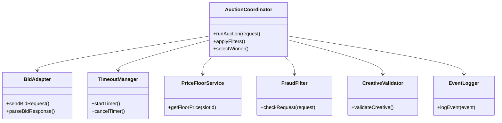
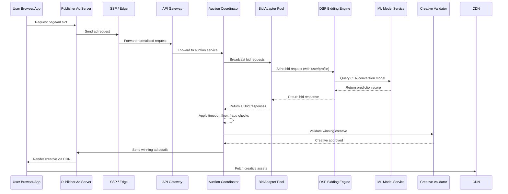
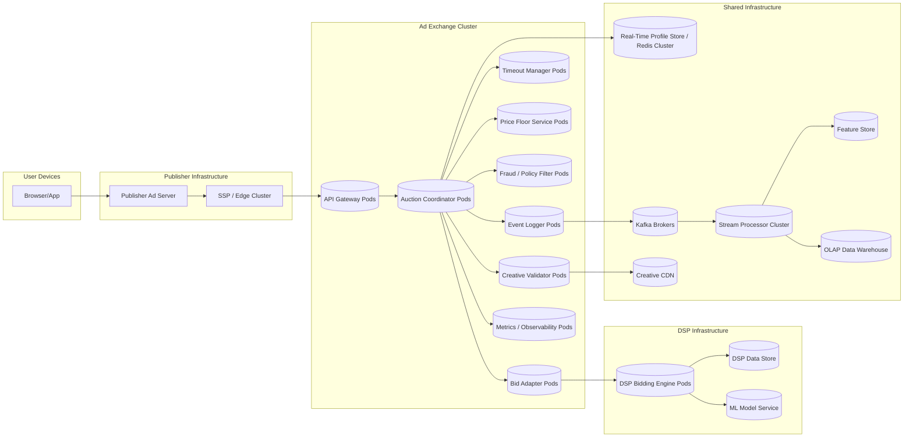

# RTB — Component-level UML Layout

## Component Diagram

**Notes:** Keep Edge and Adapter Pool horizontally scalable. Use sticky hashing by publisher/adslot for cache locality. Profile and Floor are fast key-value read paths — colocate near Edge/Auction for latency.

---

## Class Diagram (Exchange internals)

**Design hints:** AuctionCoordinator should be stateless for autoscaling and persist all inputs/outputs to EventLogger. BidAdapter should be asynchronous (non-blocking), with backpressure handling and per-adapter rate limits.

---

## Sequence Diagram (detailed auction flow)

Operational note: ensure the TimeoutManager cancels RPCs to slow DSPs as tmax approaches, and prefer non-blocking IO.

---

## Deployment Diagram

Scaling guidance: Separate adapter-service from auction-service to scale differently: adapters scale with outbound fan-out and socket counts; auction-service scales for CPU & decision latency. Use HPA on CPU + custom metrics (socket usage, p99 latency, request queue length).

---

## Interfaces & API sketches

* **Edge API** (incoming): `POST /bid` body=OpenRTB JSON, headers: `x-publisher-id`, `x-request-id`. Response: `200 OK` with `served` HTML or `204 No-Content` if no winner.
* **Adapter interface** (internal gRPC):

  * `Bid(req: BidRequest) returns (stream BidResponse)` — supports streaming responses for VAST-like multi-creative.
  * Backoff & Retry semantics are handled by adapter layer.
* **Event Logger**: asynchronous append-only API to Kafka; require ack semantics `at-least-once` and idempotency keys for deduping.

---

# Detailed Everview of major classes

---

## 1. `AuctionCoordinator`

### Functionality
- Orchestrates the real-time auction flow:
  - Receives bid requests from SSP/Exchange.
  - Triggers price floor checks, fraud/policy filters.
  - Invokes BidAdapters and TimeoutManager.
  - Aggregates bids and selects the winning bid.
  - Calls CreativeValidator and EventLogger.

### Tech Stack & Rationale
- **Go microservice** for low-latency and high concurrency.
- **fasthttp** library: high-performance HTTP handling (better than standard `net/http` for RTB rates).
- Lightweight, compiled, and optimized for millisecond-level response times.

### Throughput / Latency Targets
- Latency: 10–20 ms per auction orchestration (excluding ML scoring or network delays).
- Throughput: 1K–10K auctions/sec per node, scales linearly with replicas.

### Scaling
- Horizontal scaling: multiple Go service instances behind a load balancer.
- Stateless design: state (e.g., temporary auction info) can be stored in in-memory cache or passed in requests.
- Supports sharding by request hash or publisher ID for affinity.

### Fault Tolerance
- Graceful shutdown and request retry for failed bid requests.
- Circuit breakers on BidAdapters.
- Leader election or consensus (if some coordination is needed across multiple AuctionCoordinator instances).

---

## 2. `BidAdapter`

### Functionality
- Connects to DSP endpoints to send bid requests and receive bids.
- Encapsulates DSP-specific logic and protocols.
- Handles concurrency and bid response aggregation.

### Tech Stack & Rationale
- **Go service** leveraging goroutines for concurrent requests.
- Uses async I/O to avoid blocking on slow DSPs.
- Can run multiple replicas for redundancy.

### Throughput / Latency Targets
- Latency: 5–10 ms per DSP request (network-dependent).
- Throughput: 10K+ bid requests/sec per adapter instance (depending on concurrency and network).

### Scaling
- Horizontal replicas: multiple adapter instances per DSP endpoint.
- Sharding by DSP or request hash to distribute load evenly.
- Goroutines handle thousands of concurrent DSP requests per instance.

### Fault Tolerance
- Timeouts and retries per DSP request.
- Circuit breakers to prevent cascading failures from slow/unhealthy DSPs.
- Idempotent handling of duplicate responses.

---

## 3. `TimeoutManager`

### Functionality
- Enforces strict deadlines for bid responses.
- Cancels late bid requests and ensures auction finishes on time.
- Tracks per-bidder response times.

### Tech Stack & Rationale
- Internal **Go library** inside AuctionCoordinator.
- Uses **high-resolution timers**.
- Optional use of **eBPF/tuned sockets** for precise network event timing.

### Throughput / Latency Targets
- Overhead: sub-millisecond for timer checks.
- Can handle thousands of concurrent timers per AuctionCoordinator instance.

### Scaling
- Runs as part of AuctionCoordinator; scales with replicas.
- Timer management is lightweight and in-memory, so no additional sharding needed.

### Fault Tolerance
- Timers reset on service restart (state is ephemeral).
- AuctionCoordinator handles missing bids gracefully if timeout triggers.

---

## 4. `EventLogger`

### Functionality
- Logs all auction events, impressions, clicks, and errors.
- Feeds downstream analytics, billing, and ML pipelines.

### Tech Stack & Rationale
- **Kafka producer client** in Go.
- Use **idempotent producers** to prevent duplicate events during retries.
- Guarantees at-least-once delivery to Kafka topic.

### Throughput / Latency Targets
- Latency: <2 ms per log event.
- Throughput: millions of events/sec per Kafka cluster.

### Scaling
- Horizontal: multiple producer instances.
- Partitioning in Kafka by `publisherID`, `campaignID`, or `auctionID` for load distribution.
- Producers can buffer asynchronously to smooth spikes.

### Fault Tolerance
- Retries on Kafka broker failures.
- Local buffer to prevent data loss during short outages.
- Idempotent writes ensure no duplication.

---

## 5. `Profile Store`

### Functionality
- Stores real-time user/device profiles and features.
- Provides **sub-ms lookups** for auction decisions.
- Supports TTL-based expiration and compaction for memory efficiency.

### Tech Stack & Rationale
- **Redis Cluster** (in-memory) for ultra-low latency.
- TTLs remove stale data automatically.
- Compaction merges redundant features and reduces memory footprint.

### Throughput / Latency Targets
- Latency: 0.2–1 ms per key lookup.
- Throughput: millions of lookups/sec with clustering.

### Scaling
- Horizontal sharding by `userID` or `deviceID`.
- Replication for read availability.
- Automatic resharding to balance memory across nodes.

### Fault Tolerance
- Master-replica failover for high availability.
- Persistence (AOF or RDB) optional for recovery.
- TTLs and compaction prevent stale data from affecting decisions.
