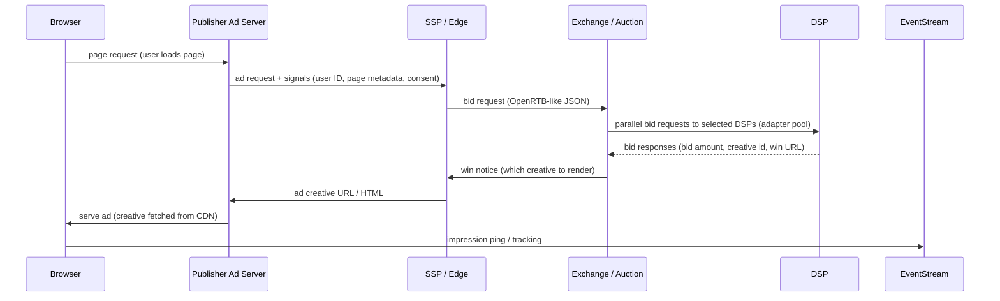

# AdBid

## High-level overview
RTB systems complete an auction for a single ad impression in ~100ms (budget varies). The main actors:
- Browser / Mobile App (Client) — the user agent where the ad will be shown.
- Publisher / Ad Server — hosts ad slots and requests bids for them.
- SSP (Supply Side Platform) — brokers publisher inventory into exchanges, enriches request.
- Ad Exchange / Auction Service — coordinates the auction, routes request to multiple DSPs, selects winner.
- DSP (Demand Side Platform) — evaluates bid requests using business rules and ML, returns bids.
- Creative CDN — serves the winning creative.
- Event/Logging Pipeline — records impressions/clicks for billing and ML.

---

## Component diagram
```
[User Browser]
    |
    | 1) page load / ad slot
    v
[Publisher Ad Server] -- (page-level targeting, consent) --> [SSP Edge / Ad Request Broker]
    |
    | 2) enriched ad request (user signals, page context)
    v
[Ad Exchange / Auction Coordinator] <----> [Real-time Profile Store (Redis/Aerospike)]
    | [Price Floor Service] [Privacy Manager]
    |---> [Bid Adapter Pool] ---> Outgoing RTB/HTTP requests ---> [Many DSPs]
    |                                   ^              ^
    |                                   |              |
    |                       [DSP Bidding Engine]   [DSP Data Stores]
    |
    | 3) winner selection & win-notify
    v
[Creative CDN] (fetch creative) --> [Browser renders ad]
```
Meanwhile: [Event Stream (Kafka)] collects bid requests, impressions, clicks -> processed by [Stream Processor (Flink/Beam)] -> feature store / DW / billing

---

## Sequence Diagram


---

## Internal modules of the Exchange (what each does)
- Edge/API Layer: receives bid requests (HTTP/2), validates, normalizes signals, enforces consent.
- Auction Coordinator: forks requests to adapters, collects responses, runs auction logic (first-price or second-price), respects price floors and deals.
- Bid Adapter Pool: pooled persistent connections (keep-alive) to DSP endpoints; per-DSP rate limiting and backoff.
- Timeout Manager: global deadline (e.g., 80–90ms) and per-adapter soft deadlines; cancels waiting adapters as deadline approaches.
- Real-time Profile Store: low-latency key-value store for user segments / recency features.
- Price Floor Service: compute dynamic floor by deal, publisher rules, or ML.
- Fraud/Policy Filter: quick heuristics to drop suspicious bids or creatives.
- Creative Validator / HTML sanitizer: ensure creative meets rules before serving.
- Event Logger: writes bid requests, responses, wins, impressions to Kafka for downstream processing.
- Metrics & Observability: high-cardinality metrics (latency p50/p90/p99, bids/sec, win-rate, socket usage, errors).

---

## Latency budget

| Step                                  |                  ms (approx) |
| ------------------------------------- | ---------------------------: |
| Browser -> Publisher (page rendering) | 0–40 (not in auction budget) |
| Publisher -> SSP / Edge               |                         5–10 |
| SSP -> Exchange + normalization       |                         5–10 |
| Exchange request fan-out to DSPs      |                         5–15 |
| DSP internal scoring & bid response   |          5–60 (DSP-specific) |
| Win selection & notify                |                          1–3 |
| Creative fetch & render               |        10–30 (CDN + browser) |
| **Total RTB auction (SSP->serve)**    |        **\~70–120ms target** |

> Operational SLO: p99 auction time < 120ms; p50 < 40ms.

---

## Data pipeline & ML

* **Event stream**: all bid-requests, bid-responses, wins, impressions, and clicks appended to Kafka (partitioned by publisher or shard).
* **Stream processing**: Flink/Beam -> real-time aggregation (e.g., frequency caps, fraud signals, inventory health metrics).
* **Feature store**: Online features in Redis/Aerospike (user recency, last-click, predicted CTR) updated via stream jobs.
* **Model training**: nightly/nearline jobs produce updated models stored in model registry.
* **Model serving**: low-latency inference endpoints colocated with DSP bidding engine or precomputed score cache.

**Optimization pattern**: precompute heavy feature joins offline; keep simple features and a tiny ML model for \~1–10ms inference inside DSP.

---

## Common auction types, bidding rules

* **First-price auction**: winner pays its bid.
* **Second-price (generalized)**: winner pays just above second-highest bid (or highest \* multiplier).
* **Private Deals / PMP**: matching based on deal IDs and reserved pricing.
* **Header bidding**: multiple SSPs/exchanges run client-side auctions first; server-side exchanges consolidate.

---

## Scaling & reliability patterns

* **Stateless services**: Exchange nodes should be stateless for easy autoscaling; persist all events to Kafka.
* **Partitioning**: shard by publisher id or publisher+adslot to reduce contention.
* **Connection pools**: persistent keep-alive connections to DSPs (socket reuse) to minimize TCP/RTT cost.
* **Backpressure**: drop non-critical traffic or shed low-value publishers when under overload.
* **Circuit breakers & per-DSP rate limiter**: avoid socket exhaustion and protect DSPs.
* **Autoscaling knobs**: scale on queue length, CPU, socket usage, and p99 latency.

---

## Storage & databases

* **Campaign config & rules**: PostgreSQL / CockroachDB (strong consistency) or DynamoDB.
* **Real-time profile store**: Redis / Aerospike / Memcached for low latency reads/writes.
* **Event sink / OLAP**: Kafka -> HDFS / S3 -> Snowflake / BigQuery for analysis and billing.
* **Time-series**: Prometheus + long-term TSDB (Cortex, Mimir) for metrics.

---

## Security, privacy & compliance

* **Consent enforcement**: TCF v2.0 / local consent gating before sending signals to DSPs.
* **PII minimization**: never send raw personal identifiers; use hashed IDs or identity graph tokens.
* **Encryption**: TLS for all network hops; encrypt data at rest for event logs.
* **Audit & policy controls**: creative scanning, malware detection, brand-safety scoring.

---

## Observability & SLOs

**Key metrics**: bidRequests/sec, bidsReturned/sec, winRate, fillRate, avgBidPrice, auctionLatency p50/p90/p99, socketCount, adapterTimeouts, eventLag (Kafka consumer), errors/sec.

**Tracing**: distributed tracing (W3C / OpenTelemetry) from publisher request to DSP response to creative fetch.

**SLO examples**:

* p99 exchange processing latency < 120ms
* adapter error rate < 0.5%
* availability > 99.95%

---

## Example OpenRTB-like request

```json
{
  "id":"req-123",
  "imp":[{"id":"1","banner":{"w":300,"h":250}}],
  "site":{"domain":"example.com","page":"https://example.com/article"},
  "device":{"ua":"Chrome", "ip":"0.0.0.0"},
  "user":{"id":"hashed-user-abc"},
  "tmax":80
}
```

`tmax` tells bidders their maximum allowed response time (ms).

---

## Typical failure modes & runbook (short)

**Symptoms**: rising p99 latency, many adapter timeouts, socket exhaustion, message-lag on Kafka.

**Immediate checks**:

1. Check adapter timeout rates / socket errors. If socket exhaustion → increase pool sizes or throttle outgoing fan-out.
2. Check queue length and CPU on exchange nodes. Scale up/out if CPU bound.
3. Check Kafka consumer lag on event logger; if lagging, slow consumers can cause data loss in offline systems.
4. Check DSP partner health — reroute or rate-limit misbehaving DSPs with circuit breaker.

---

## Example technology map (suggested)

* Edge/API: Envoy / Nginx + gRPC or HTTP/2
* Exchange & Ad Server: Go (low-latency), fast JSON/Protobuf parsing
* Connection pooling: custom adapter layer with async IO (Netty for Java / ebpf-socket tuning)
* Cache: Redis / Aerospike
* Event stream: Kafka
* Stream processing: Flink / Apache Beam
* Feature store: Redis (online) + BigQuery / Snowflake (offline)
* ML serving: Triton / ONNX runtime or small native scoring in process
* Storage: Postgres for config, S3 for raw events + DW

