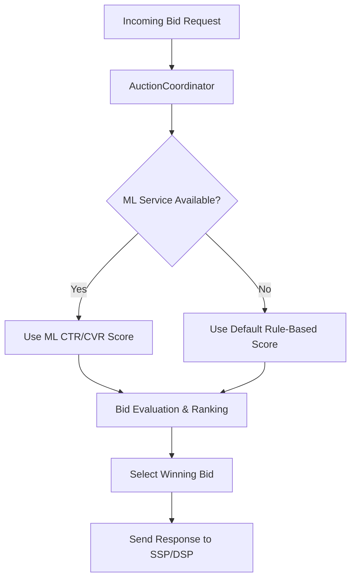

# Success Metrics, Dashboards & Risk

## 1. Technical KPIs

| Metric                   | Target / Expectation                     | Telemetry Source                                | Notes |
|---------------------------|------------------------------------------|------------------------------------------------|-------|
| **Latency (P50/P95)**    | <20ms (P50), <100ms (P95)                | Prometheus histograms (`auction_latency_ms`)    | Export from Go services via fasthttp middleware. |
| **Throughput (QPS)**     | 100K – 1M QPS (scalable)                 | Prometheus counters (`requests_total`) + Kafka topic offsets | Use `rate()` in Grafana for per-second throughput. |
| **System Uptime**        | ≥99.99%                                  | Kubernetes liveness/readiness probes, Prometheus `up` metric | Measured per service, aggregated globally. |
| **Rule Evaluation Accuracy** | 99.9%+ correct budget & pacing        | Flink job logs, Redis/Aerospike counters vs. ClickHouse aggregates | Cross-check online vs. offline counters daily. |
| **Cost to Serve**        | <$1 per 1M requests                      | ClickHouse billing tables (infra cost logs) + Cloud cost APIs | Normalize infra cost vs. request volume. |

---

## 2. Business KPIs

| Metric                  | Target / Expectation                   | Telemetry Source                              | Notes |
|--------------------------|----------------------------------------|-----------------------------------------------|-------|
| **Bid Response Win-Rate** | 10–20%                                | Kafka topic `bids` (response vs. wins) → ClickHouse aggregation | DSP-specific breakdowns via tags. |
| **Fill Rate(per SSP)**    | >80%                                   | SSP → Exchange logs in Kafka (`ad_requests` vs. `ad_served`) | Real-time ratio tracked in Grafana. |
| **CTR / CVR Lift**       | +X% post-ML integration                | ClickHouse event tables (`impressions`, `clicks`, `conversions`) | Use dashboards in Superset/Looker. |
| **Budget Pacing Accuracy** | ±2% deviation daily                   | Redis/Aerospike counters (online) vs. Flink aggregates (streaming) → ClickHouse | Alert if deviation >2%. |

---

## 3. Dashboards (Observability)

**Tools:**  
- **Grafana** → real-time technical KPIs.  
- **ClickHouse/Druid + Superset/Looker** → business KPIs, historical trends.  
- **Prometheus + Alertmanager** → SRE alerts.  

### a. Latency & Throughput
- Latency histogram (P50, P95, P99) per service.
- QPS breakdown by component (`AuctionCoordinator`, `BidAdapter`, `Profile Store`).
- Heatmap: latency by DSP.

### b. Reliability & Uptime
- SLA compliance % (<100 ms auctions).
- Per-service uptime graph (Prometheus `up`).
- Error classification: timeouts, invalid responses, fraud rejections.

### c. Rule Evaluation & Budget Pacing
- Real-time pacing deviation dashboard (Redis vs. Flink aggregates).
- Budget utilization % (per campaign, per DSP).
- Alerts for overspend >5% or underspend >5%.

### d. Business Outcomes
- Bid win-rate by DSP (ClickHouse query on bid logs).
- Fill rate by SSP/publisher.
- CTR/CVR trend lines before vs. after ML deployment.
- Infra cost per 1M requests (Grafana + ClickHouse).

---

## 4. Alerts (SRE / On-Call)

| Alert Trigger             | Threshold                      | Source             | Action |
|----------------------------|--------------------------------|--------------------|--------|
| **Latency breach**         | >100ms P95 for >5 minutes      | Prometheus histograms | PagerDuty alert, auto-scale. |
| **Throughput drop**        | <90% of baseline QPS           | Prometheus + Kafka offsets | Check Kafka lag, pod scaling. |
| **Budget anomaly**         | >±5% deviation from pacing     | Flink vs. Redis counters | Alert product + disable overspending campaigns. |
| **Infra cost spike**       | >20% week-over-week increase   | ClickHouse billing table + Cloud API | Review scaling policies, cost optimizations. |

## 5. Risk Assessment

| Risk                          | Impact                                                        | Mitigation                                                                                       |
|-------------------------------|---------------------------------------------------------------|-------------------------------------------------------------------------------------------------|
| **Latency spikes under scale** | Auctions may exceed SLA (>100ms), leading to lost bids & revenue | - Use fasthttp, connection pooling - Horizontal scaling of AuctionCoordinator - Pre-warm caches - Continuous latency profiling & autoscaling |
| **Redis cache misses**        | Extra DB lookups or auction failure → higher latency, inconsistent targeting/budget | - Write-through caching with TTL - Shard & replicate Redis, enable persistence - Monitor cache hit ratio (<95% triggers alert) - Fallback to safe default behavior |
| **Budget overdelivery**       | Advertisers spend more than allocated → financial/legal exposure | - Atomic counters in Redis/Aerospike per request - Distributed locks or Lua scripts - Secondary reconciliation in OLAP (ClickHouse/Druid) - Hard stop thresholds (e.g., 99.5% spent) |
| **Kafka consumer lag**        | Delayed event logging (impressions, clicks), breaking pacing & reporting | - Tune partitioning & batch sizes - Scale consumers horizontally - Use monitoring (Burrow, Cruise Control) - Prioritize exactly-once idempotent producers |
| **ML signal delays or failures** | Missing/late scores reduce bid quality, lower win rate & eCPM | - Timeout fallback to heuristic bidding - Replicated ML inference service with caching - Async enrichment pipeline (Flink/Kafka) - Canary release for new models |
| **Partial system outages**    | Lost traffic, failed auctions, revenue loss                  | - Multi-region deployment  - Circuit breakers & retries - Graceful degradation (auction continues without optional services) - Runbooks & automated failover (K8s + service mesh) |

**Graceful degradation**

