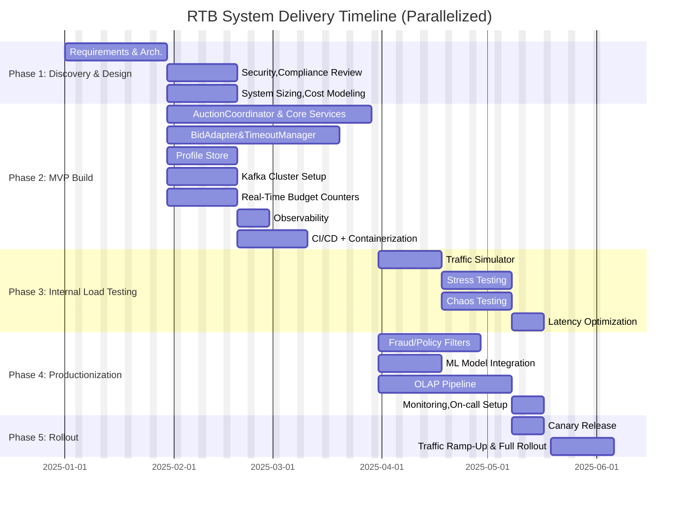

# Real-Time Bidding (RTB) System — Team Structure

This document describes the ideal team structure to deliver a high-performance RTB platform.

---

## 1. Backend Engineers

### Responsibilities
- Implement core services: `AuctionCoordinator`, `BidAdapter`, `TimeoutManager`, `EventLogger`, `Profile Store` integration.
- Optimize for low-latency, high-throughput processing.
- Ensure reliable microservice communication and fault tolerance.

### Suggested Team Size
- 4–6 engineers
  - Auction & Bidding sub-team: 2–3
  - Profile & Logging sub-team: 2–3

### Collaboration
- Work closely with DevOps/SRE for deployment and scaling.
- Coordinate with Data/ML teams for real-time feature availability.
- Integrate with QA for automated testing and RTB simulations.

### Skillset
- Strong Go programming.
- Low-latency microservice architecture.
- HTTP/gRPC protocols and fasthttp optimization.
- Concurrency, goroutines, and high-performance network I/O.
- Experience with Redis/Aerospike/Kafka integration.

---

## 2. ML / Data Engineers

### Responsibilities
- Build and deploy ML models for CTR/CVR predictions.
- Design and maintain feature pipelines.
- Ensure data availability in real-time profile stores.

### Suggested Team Size
- ML: 2–3 engineers
- Data Engineering: 2–3 engineers

### Collaboration
- Backend: Serve models via endpoints for auctions.
- Product: Align features and metrics with business KPIs.
- Observability: Track model performance and drift.

### Skillset
- ML frameworks: TensorFlow, PyTorch, XGBoost.
- Feature engineering and data preprocessing.
- Stream processing (Flink/Beam/Kafka Streams).
- Data modeling, ETL pipelines, and online/offline feature stores.
- Metrics tracking and experimentation (A/B testing).

---

## 3. DevOps / Site Reliability Engineers

### Responsibilities
- Deploy, monitor, and scale microservices.
- Manage Kafka, Redis/Aerospike, Flink clusters.
- Ensure high availability, failover, and disaster recovery.

### Suggested Team Size
- 2–3 engineers

### Collaboration
- Backend: Load testing, tuning, and deployment automation.
- QA: Support test environments and production-like simulation.
- Observability: Implement monitoring, logging, and alerting pipelines.

### Skillset
- Cloud infrastructure (AWS/GCP/Azure), Kubernetes, Docker.
- Kafka, Redis/Aerospike, Flink, and microservice orchestration.
- Prometheus/Grafana for metrics and alerting.
- CI/CD pipelines and automation tools.
- Incident response and capacity planning.

---

## 4. QA / Test Engineers

### Responsibilities
- Build automated unit, integration, and system tests.
- Simulate RTB auctions at scale.
- Validate latency, throughput, correctness, and budget enforcement.

### Suggested Team Size
- 2–3 engineers

### Collaboration
- Backend: Service contract testing and RTB workflow validation.
- ML/Data: Model integration testing.
- DevOps: Support test environments for performance testing.

### Skillset
- Test automation frameworks (Go, Node.js, Python).
- Load testing tools (Gatling, JMeter, Locust).
- Knowledge of RTB auction flows and protocols.
- CI/CD integration for automated regression testing.

---

## 5. Product / Technical PM

### Responsibilities
- Define auction rules, feature requirements, dashboards, KPIs.
- Prioritize features and coordinate sprints.
- Bridge business/advertiser needs with engineering execution.

### Suggested Team Size
- 1 PM

### Collaboration
- Engineering: Requirements clarification, backlog grooming.
- ML/Data: Define model KPIs and metrics.
- Frontend/Analytics: Ensure dashboards meet business needs.

### Skillset
- Product management frameworks (Agile, Scrum, Kanban).
- Strong understanding of RTB, programmatic advertising, and ad tech.
- Excellent communication across technical and business teams.
- Metrics-driven decision making.

---

## 6. Observability / Analytics Specialist

### Responsibilities
- Implement metrics, dashboards, and logging pipelines.
- Monitor auction latency, spend, pacing, and KPIs.
- Provide alerts and anomaly detection.

### Suggested Team Size
- 1–2 engineers

### Collaboration
- Backend/DevOps: Instrument services for metrics.
- Product: Create dashboards for business monitoring.
- Data/ML: Track feature performance and model outputs.

### Skillset
- Prometheus/Grafana, ClickHouse, Druid, BigQuery.
- Logging frameworks (ELK, Fluentd, Kafka).
- Data visualization and dashboarding.
- Alerting and monitoring strategies.

---

## 7. Frontend / Dashboard Engineers

### Responsibilities
- Build internal dashboards for campaign monitoring, spend, auction metrics.
- Visualize real-time and historical data.

### Suggested Team Size
- 1–2 engineers

### Collaboration
- Product: Understand visualization needs.
- Observability/Analytics: Consume metrics and events.
- Backend: Connect APIs and streaming endpoints.

### Skillset
- Modern frontend frameworks (React, Vue, Angular).
- WebSockets / SSE for real-time updates.
- Data visualization libraries (D3.js, Recharts, Chart.js).
- UX design principles for internal tooling.

---

## 8. Collaboration Summary

- **Backend ↔ ML/Data**: Real-time inference and feature pipelines.
- **Backend ↔ DevOps/SRE**: Deployment, scaling, and fault-tolerance.
- **Backend ↔ QA**: Testing auction logic, performance, and budget enforcement.
- **ML/Data ↔ Product**: Define KPIs, metrics, and campaign optimization.
- **Observability ↔ Product & Backend**: Dashboards, monitoring, and alerts.
- **Frontend ↔ Product & Analytics**: Internal visualizations for real-time operations.

---

## 9. Total Team Size Estimate

| Function | Engineers |
|----------|-----------|
| Backend | 4–6 |
| ML/Data | 4–6 |
| DevOps/SRE | 2 |
| QA | 2 |
| Product/PM | 1 |
| Observability/Analytics | 1–2 |
| Frontend | 1–2 |
| **Total** | 15–20 engineers |

---

# High-Level Delivery Timeline

This plan assumes above team structure. Timelines are approximate and can overlap for faster delivery.

---

## 1. Discovery & Design (3 weeks)

**Activities**
- Requirements gathering with Product & stakeholders.
- Define core auction rules, SLAs (latency, throughput, budget enforcement).
- High-level architecture (microservices, Kafka, Redis, Flink, OLAP store).
- Selection of tech stack (Go, fasthttp, Redis, Kafka, Flink, ClickHouse/Druid).
- Security, compliance, and privacy review (GDPR/CCPA).
- System sizing & cost modeling.

**Dependencies**
- Product team provides clear auction/bidding requirements.
- Early infra sizing input from DevOps.

**Deliverables**
- Detailed architecture diagrams (component, sequence, deployment).
- Initial backlog and roadmap.
- POC benchmarks for Redis/Kafka latency.

---

## 2. MVP Build (8–10 weeks)

**Activities**
- Implement **AuctionCoordinator**, **BidAdapter**, **TimeoutManager**, **EventLogger**.
- Stand up Redis Cluster (Profile Store) + Kafka cluster.
- Integrate ML stub service (dummy scores).
- Build real-time budget counters (Redis/Aerospike).
- Basic observability: Prometheus, Grafana dashboards.
- CI/CD pipelines, containerization (Docker, Kubernetes).

**Dependencies**
- Design artifacts from Phase 1.
- DevOps provides Kubernetes + Kafka clusters.
- QA sets up initial test framework.

**Deliverables**
- End-to-end RTB auction flow working in dev.
- API contract between SSP ↔ Exchange ↔ DSP.
- Metrics dashboards for latency, throughput, errors.

---

## 3. Internal Load Testing (3 weeks)

**Activities**
- Develop RTB traffic simulator (10K–100K QPS).
- Stress-test AuctionCoordinator + BidAdapters.
- Tune Redis/Aerospike for profile lookups and budget counters.
- Kafka throughput validation (multi-million events/sec).
- Chaos testing for failure scenarios (DSP timeout, Kafka node crash).
- Latency optimization (profiling, fasthttp tuning, GC tuning).

**Dependencies**
- MVP build must be feature-complete for core auction flow.
- QA and DevOps lead test orchestration.

**Deliverables**
- Benchmark reports (latency, throughput, P95/P99 performance).
- Scaling guidelines (per-node QPS capacity, Redis/Kafka cluster sizing).
- Identified bottlenecks and remediation plan.

---

## 4. Productionization (4 weeks)

**Activities**
- Harden microservices (timeouts, retries, circuit breakers).
- Secure endpoints (TLS, mTLS with DSPs/SSPs).
- Implement advanced fraud/policy filters.
- Connect real ML model service for CTR/CVR scoring.
- Add persistent OLAP pipeline (ClickHouse/Druid for reporting).
- Full monitoring & alerting setup (on-call runbooks).
- Documentation + incident response drills.

**Dependencies**
- Load testing benchmarks.
- ML team delivers trained model with inference API.

**Deliverables**
- Production-ready cluster deployment (multi-region optional).
- Verified SLAs (e.g., <100ms auction latency at P99).
- Fully observable, fault-tolerant RTB exchange.

---

## 5. Rollout Plan (3 weeks)

**Activities**
- Canary release with one SSP and a limited set of DSPs.
- Monitor metrics (latency, win rates, budget pacing).
- Incremental rollout across regions/partners.
- Post-mortems after each phase to ensure stability.
- Gradual traffic ramp-up to full load.

**Dependencies**
- Production-ready system from Phase 4.
- DSP/SSP integration readiness.

**Deliverables**
- Live RTB exchange with advertiser demand.
- SLA adherence at production scale.
- Continuous feedback loop for optimizations.

---

# ⏱️ Summary Timeline

| Phase                | Duration  | Dependencies |
|----------------------|-----------|--------------|
| Discovery & Design   | 3 weeks | Product input, infra sizing |
| MVP Build            | 8–10 weeks| Design complete, infra provisioned |
| Internal Load Testing| 4 weeks | MVP feature-complete |
| Productionization    | 4 weeks | Load test results, ML model |
| Rollout Plan         | 3 weeks | Productionized system, DSP/SSP readiness |

**Total Duration:** ~22-24 weeks (~6 months) depending on scope, infra readiness, and team size.

---

